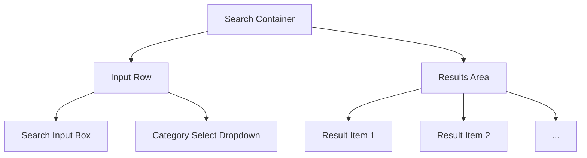

# Search UI Wireframe Specification

This document defines the minimal functional requirements and layout for the first ThoughtReach search interface.

## 1. Core Logic & Elements

### Search Input
- **Type**: Text Input.
- **Placeholder**: "Search your conversations..."
- **Action**: Triggers semantic retrieval on `Enter` or `Search` button click.

### Category Selector (Optional)
- **Type**: Dropdown / Select Menu.
- **Options**: 
  - "All Categories" (Default - null filter).
  - List of categories fetched from `GET /categories`.
- **Purpose**: Restricts the search scope to a specific category.

---

## 2. Global Layout

---

## 3. Result Item Component

Each result should be displayed as a **Card** or **Expandable Row** with the following information:

### Primary Header (Always Visible)
- **Conversation Title**: Main identifier of the source conversation.
- **Category Badge**: Display `category_name` (or "Uncategorized" if null).
- **Match Score**: Display `similarity_score` (e.g., as a percentage or decimal).

### Content Snippet (Always Visible)
- **Matched Text**: The `matched_chunk_text` returned by the API. 
- **Requirement**: Use a fixed-height container with "..." for overflow if necessary.

### Expanded View (Optional / Interaction)
- **Context**: Display `surrounding_messages` to show where the match occurred in the thread.
- **Action**: Toggle visibility of message history for the specific match.

---

## 4. UI States

### Empty State
- **Trigger**: Search returns `[]`.
- **Display**: "No relevant conversations found for this query."
- **Action**: Suggest broad search terms or clearing the category filter.

### Error State
- **Trigger**: API returns `404` (Invalid Category) or `500`.
- **Display**: "Category missing or server error. Please refresh and try again."

---

## 5. Summary of API Mapping

| UI Element | API Field |
| :--- | :--- |
| **Result Title** | `conversation_title` |
| **Category Label** | `category_name` |
| **Snippet** | `matched_chunk_text` |
| **Score** | `similarity_score` |
| **Details** | `surrounding_messages` |
